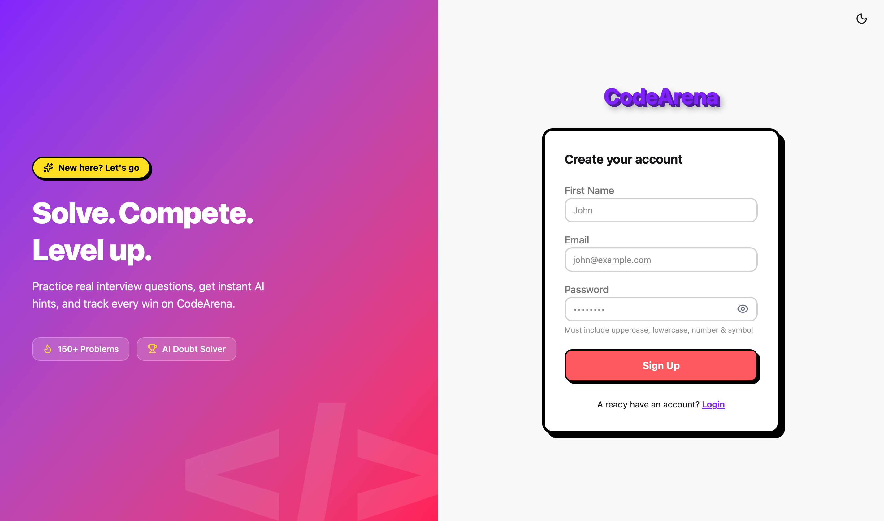
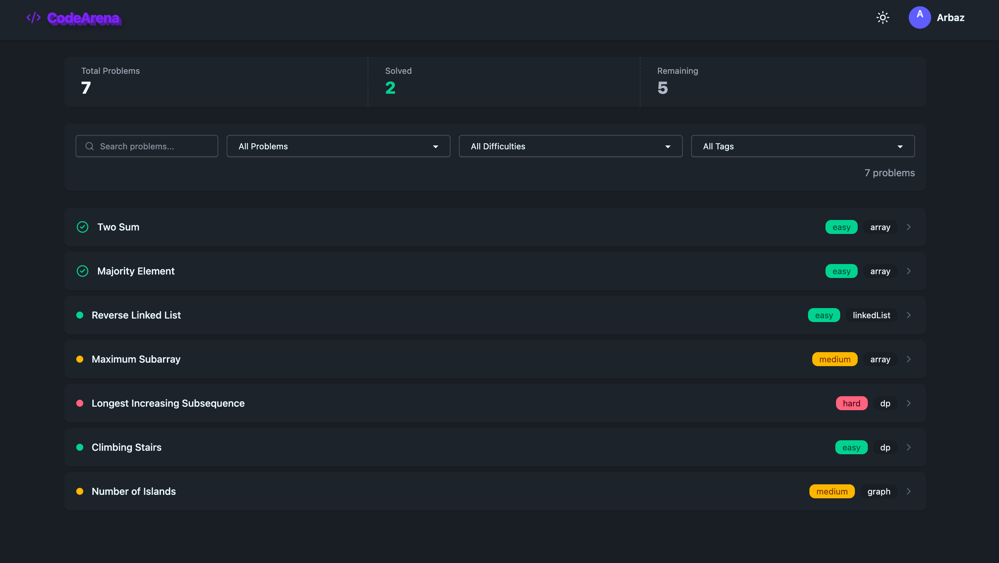
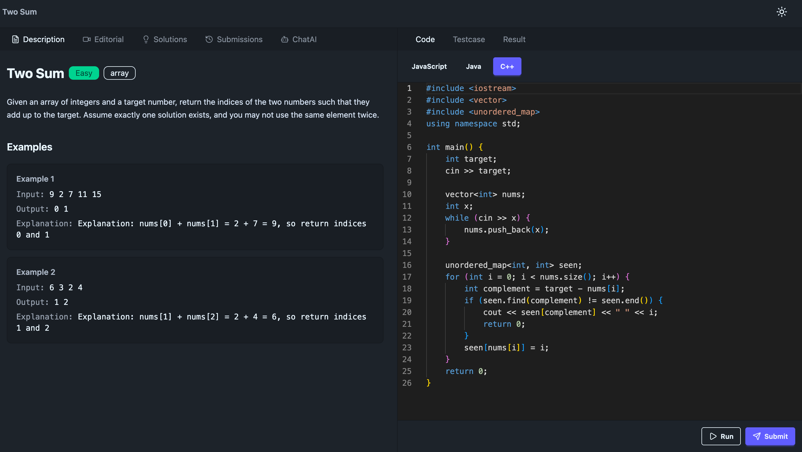
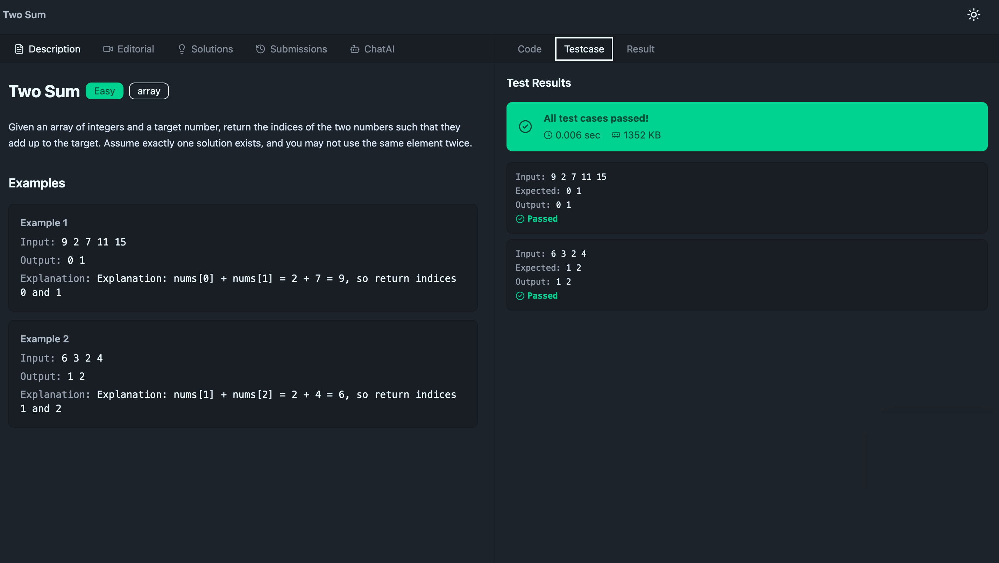
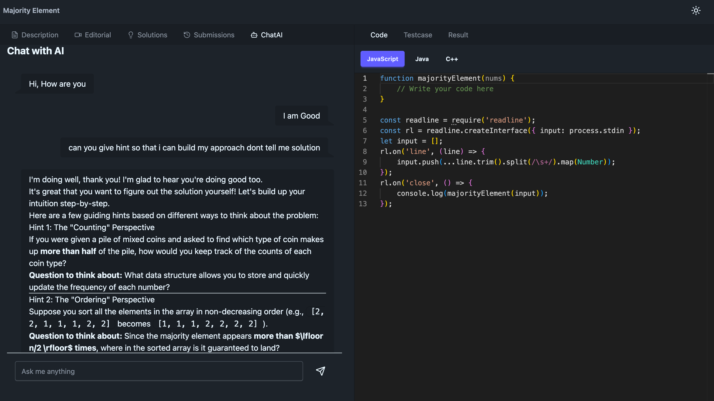
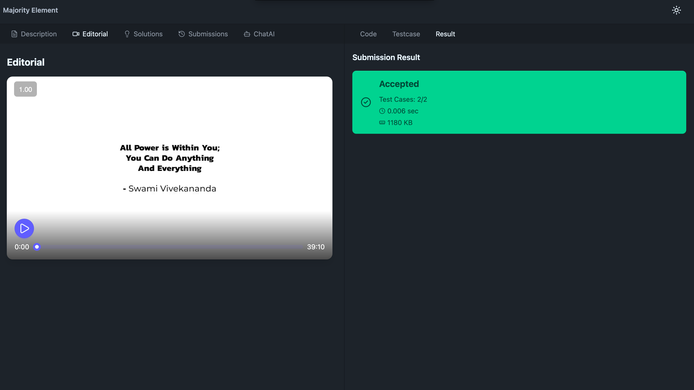
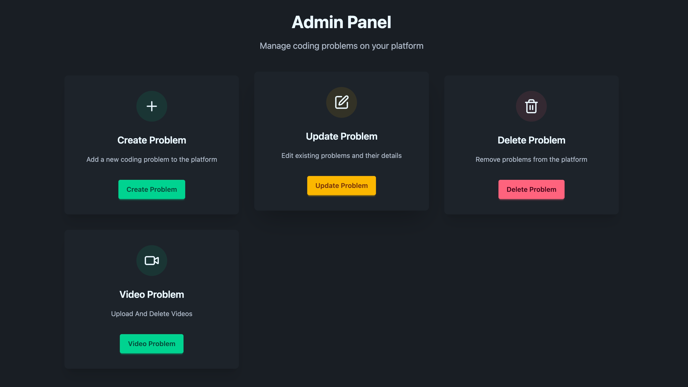

# CodeArena

A full-stack, LeetCode-style coding practice platform — write and run code in a sandboxed judge, get AI-powered hints, and track your progress.


**Live:** [Frontend](https://codearena-frontend-zeta.vercel.app) · [Backend API](https://codearena-backend-vurk.onrender.com)



---

## Features

- JWT-based auth (httpOnly cookies) with role-based access — user / admin
- Secure, stateless logout via a Redis-backed JWT blocklist
- Browse, search, and filter problems by difficulty, tag, and status
- Monaco code editor — Run against visible test cases, Submit against hidden ones (Judge0)
- Submission history per user, per problem
- AI doubt-solving assistant (Google Gemini), scoped to the current problem
- Admin panel — full CRUD for problems and video editorials (Cloudinary signed uploads)
- Light/dark theme

### Problem List



### Code Editor & Test Execution

Monaco-based editor with per-language starter code, running against Judge0 in a sandboxed environment:




### AI Doubt-Solving

Scoped to the current problem — gives step-by-step hints, not the direct solution:



### Video Editorials



### Admin Panel

Full CRUD for problems and video content:



---

## Tech Stack

**Frontend** — React, Vite, Redux Toolkit, Tailwind CSS v4, DaisyUI, react-hook-form, Zod, Monaco Editor
**Backend** — Node.js, Express, MongoDB Atlas (Mongoose), Redis, JWT, bcrypt
**Integrations** — Judge0 (RapidAPI) for code execution · Google Gemini for AI hints · Cloudinary for video storage
**Deployment** — Vercel (frontend) · Render (backend)

---

## Architecture

```
[ React SPA — Vercel ]  --axios, withCredentials-->  [ Express API — Render ]
                                                              |---> Judge0 (RapidAPI)
                                                              |---> Google Gemini
                                                              |---> Cloudinary
                                                              v
                                        [ MongoDB Atlas ]           [ Redis ]
                                         users/problems/submissions  JWT blocklist
```

---

## Getting Started

### Prerequisites
Node.js v18+, a MongoDB Atlas URI, a Redis instance, and API keys for Judge0 (RapidAPI), Gemini, and Cloudinary.

### Backend
```bash
cd backend
npm install
```
Create `backend/.env` (adjust names to match your actual keys):
```env
PORT=3000
MONGO_URI=your_mongodb_connection_string
REDIS_URL=your_redis_url
JWT_SECRET=your_jwt_secret
JUDGE0_API_KEY=your_rapidapi_key
GEMINI_API_KEY=your_gemini_api_key
CLOUDINARY_CLOUD_NAME=your_cloud_name
CLOUDINARY_API_KEY=your_api_key
CLOUDINARY_API_SECRET=your_api_secret
FRONTEND_URL=http://localhost:5173
```
```bash
npm run dev
```

### Frontend
```bash
cd frontend
npm install
```
Create `frontend/.env`:
```env
VITE_API_BASE_URL=http://localhost:3000
```
```bash
npm run dev
```

Frontend: `http://localhost:5173` · Backend: `http://localhost:3000`

---

## API Reference

| Method | Route | Auth | Purpose |
|---|---|---|---|
| POST | `/user/register` | Public | Signup |
| POST | `/user/login` | Public | Login |
| POST | `/user/logout` | User | Logout (Redis blocklist) |
| GET | `/user/check` | User | Session check |
| GET | `/problem/getAllProblem` | Public | Problem list |
| GET | `/problem/problemById/:id` | Public/User | Problem details |
| POST | `/problem/create` | Admin | Create problem |
| PUT | `/problem/update/:id` | Admin | Update problem |
| DELETE | `/problem/delete/:id` | Admin | Delete problem |
| POST | `/submission/run/:id` | User | Run against visible tests |
| POST | `/submission/submit/:id` | User | Submit against hidden tests |
| POST | `/ai/chat` | User | AI doubt-solving |
| GET | `/video/create/:problemId` | Admin | Cloudinary signed-upload signature |
| POST | `/video/save` | Admin | Save video metadata |

---

## Known Limitations

- **Safari cross-site cookie policy:** The frontend (Vercel) and backend (Render) are on different domains, so auth relies on a `SameSite=None` cookie. Safari's Intelligent Tracking Prevention is stricter about cross-site cookies than Chrome/Firefox and may affect session persistence for some users. A same-site deployment (single domain, reverse-proxied) or a token-based fallback would remove this dependency.
- Rate limiting is IP-based, so users on the same shared network (e.g. college Wi-Fi) share one limit.
- `/submit` and `/run` currently share a single rate-limit bucket (5 requests/minute combined).

## Roadmap

- [ ] Async job queue (BullMQ) for submissions
- [ ] Redis caching for the problem list
- [ ] Timed contests + leaderboard
- [ ] Automated tests (Jest/Supertest)

---

## Author

**Arbaz** — [@ARBAZ07-bot](https://github.com/ARBAZ07-bot)
